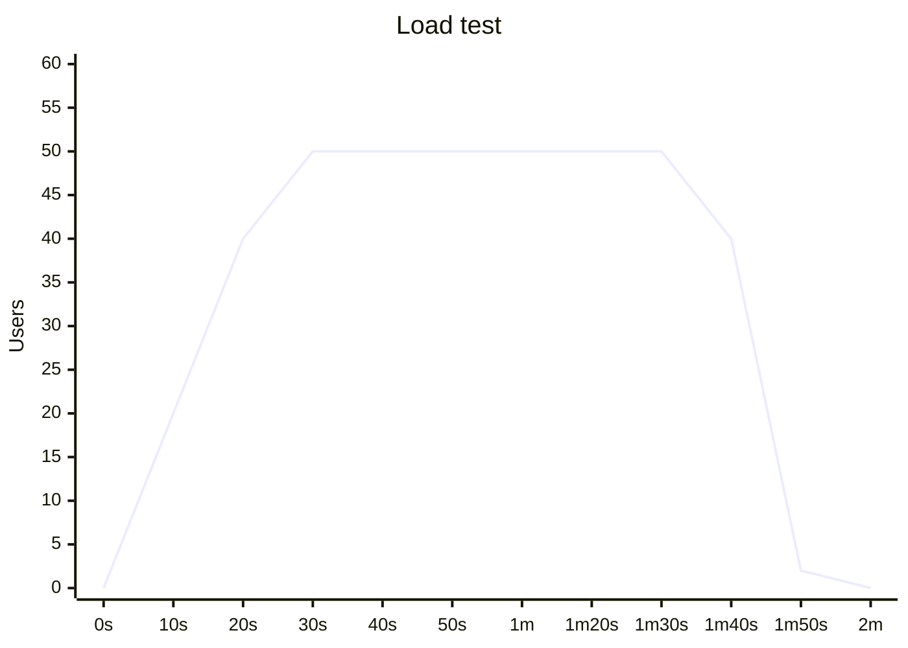
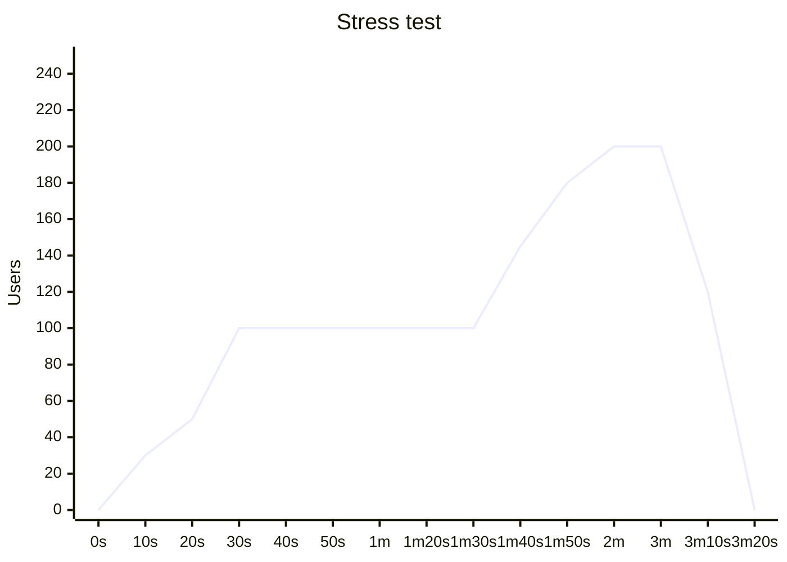

# Soar test automation

This project provides 3 different kinds of automation apps:

1. e2e - OWASP jiuce shop
2. mobile
3. performance

## Tech stack

- node.js
- pnpm - for package and monorepo magement
- [playwright](https://playwright.dev/) - for e2e web tests
- appium + wdio - for mobile automation
- [k6](https://k6.io/) - for performance tests
- [allure reporter](https://allurereport.org/)

## Get started globally

Install all dependencies via command `pnpm i` - this command automatically install all dependencies in all sub-modules

## E2E

Precondition:

1. node.js
2. pnpm (`npm i -g pnpm`)
3. install project dependencies from root: `pnpm i`
4. Get juice shop (you can run below commands in another directory)

- `git clone https://github.com/juice-shop/juice-shop.git --depth 1`
- `npm install`
- `npm start`
- browse `http://locahost:3000`

After jiuce shop will be available - you are set to run tasks

Run all e2e tests:

`pnpm e2e`

Run only 1 test (e.g. task1):

`pnpm e2e task1`

Task tests available by path: `apps/e2e/tests/*.test.ts`

## Mobile Android

Prerequirements

- node.js
- pnpm
- java
- [android studio](https://developer.android.com/studio)
- (nice to have, not required) [appium inspector](https://github.com/appium/appium-inspector)

### Set up the project requirements

1. install add dependencies (`pnpm install`)
2. run `pnpm dx:doctor` to ensure that everything is OK
3. install UIAutomator2 driver (`appium driver install uiautomator2`)
4. ensure that UIAutomator2 driver installed correctly `pnpm appium driver doctor uiautomator2`

### Run Tests

To run all tests:

`pnpm run test`

To run exclusive test:

`pnpm test --suite task<N>`

### Most common issues

#### ✖ ANDROID_HOME environment variable is NOT set!

Open settings -> SDK -> find path to android SDK

see the link: https://stackoverflow.com/a/19986294

#### ✖ JAVA_HOME environment variable is NOT set!

Install Java: https://www.oracle.com/java/technologies/downloads/?er=221886#java23

run for macos:

```bash
export JAVA_HOME="$(/usr/libexec/java_home)"
```

See: https://stackoverflow.com/a/22842806

#### ✖ apkanalyzer could NOT be found

Install command line tools in android SDK. See: https://stackoverflow.com/a/73720798

### Appium inspector

1. install appium inspector
2. launch appium inspector
3. start appium server (`pnpm appium`) in bakcground
4. connect to appium using following capabilities

```json
{
  "platformName": "Android",
  "appium:deviceName": "Android GoogleAPI Emulator", // or use the existing name from android SDK
  "appium:automationName": "UiAutomator2",
  "appium:app": "<insert full path here>/apps/mobile/bin/Wikipedia.apk",
  "appium:ensureWebviewsHavePages": true,
  "appium:nativeWebScreenshot": true,
  "appium:newCommandTimeout": 3600,
  "appium:connectHardwareKeyboard": true
}
```

## Web Performance

Pre requirements:

- node.js
- k6
  - [installation guide](https://grafana.com/docs/k6/latest/set-up/install-k6/)

Requirements:

- a Flask app in background
  - `pip3 install -r requirements.txt`
  - `pip3 install PyJWT`
  - `pip3 install requests`

### Run performance test


There is 2 different tests:

1. Load test for `/client_registeration` endpoint
2. Stress test for `/client_login` endpoint

Each test has own output in `performance/k6-report` folder.

Please note that each test collect only [built-in](https://grafana.com/docs/k6/latest/using-k6/metrics/reference/#built-in-metrics) metrics. If you wish to export metrics to somewhere else - read this [doc](https://grafana.com/docs/k6/latest/results-output/)

### Load test

This test call endpoint with **general** capabilities on a short time. (~2 minutes)

Is a test with next stages:

- ramp up 50 users during 30 seconds
- hold 50 users during 1 minute
- ramp down to 0 users during 20 seconds

Graph looks like this:



### Stress test

This test call endpoint with **extreme** capabilities on a short time. (~3m 20s)

Is a test with next stages:

- ramp up 100 users during 30 seconds
- hold 100 users during 1 minute
- ramp up to 200 users during 30 seconds
- hold 200 users during 1 minute
- ramp down to 0 users during 20 seconds

Graph looks like this:



### BDD test

shows the single test in BDD style.

use official BDD style: https://grafana.com/docs/k6/latest/javascript-api/jslib/k6chaijs/

## Logical security

Risk score formulae:
```txt
Risk Score = Impact × Likelihood
```

Where Impact:
- How severe is the issue? High, Medium, or Low
- Does it affect critical functionality, a small feature, or aesthetic aspects?

Likelihood:
- What is the probability that the bug will occur or be encountered? High, Medium, and Low.
- factors like code exposure, usage frequency, or known edge cases.

Other Info:

Exposure:
- Who is impacted (e.g., all users, admin users, a small subset)?
- Is the bug visible to customers or only internal teams?

Low = 1
Medium = 2
Hight = 3

Example of high risk score (severity=High, likelihood=high)

```txt
Risk score = 3 * 3 = 9
```

Logical-security results located [here](./apps/logical-security)

## Test management

- [Test plan](./apps/test-management/test-plan.md)
- [risk based testing](./apps/test-management/risk-based-testing.md)
